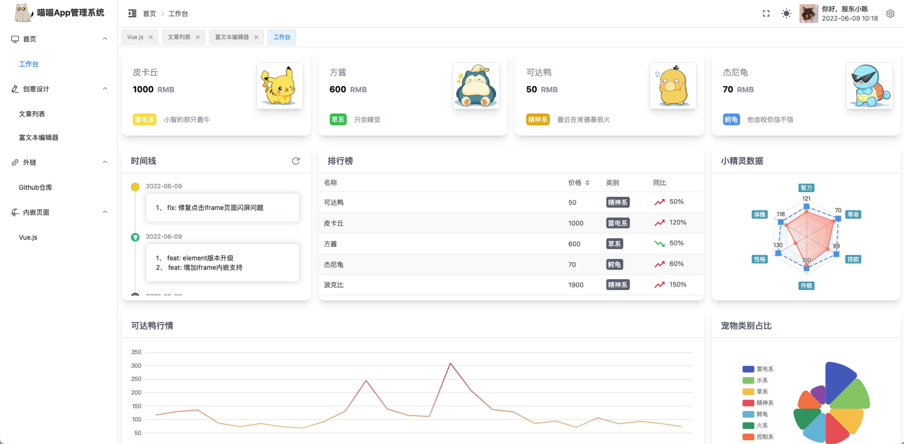
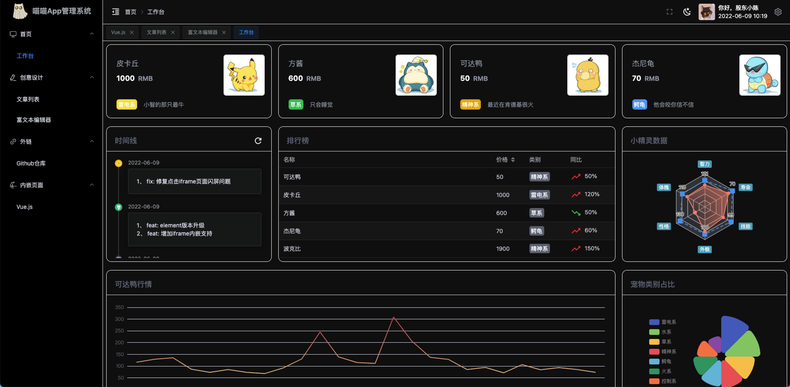
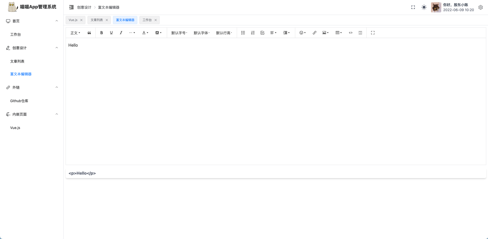
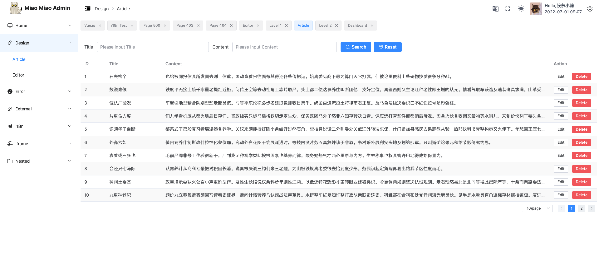
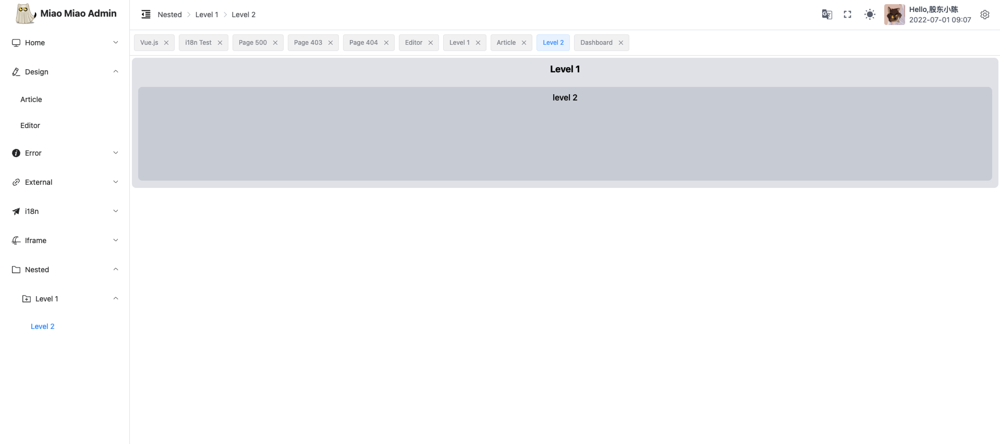
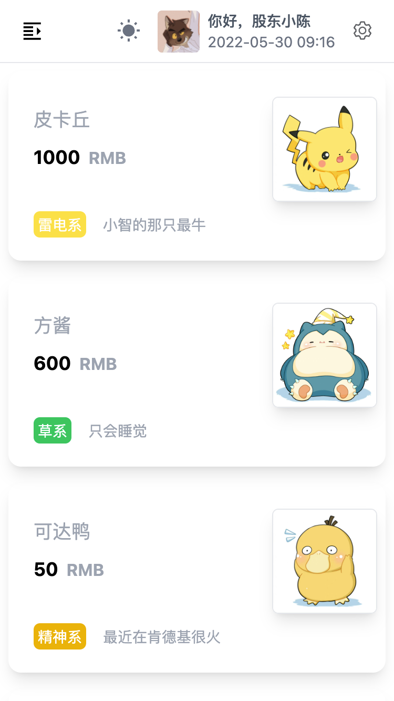

<h1>cloud-app-admin☁️</h1>

<p align="center">
  <a href="https://github.com/vuejs/core">
    
  </a>
  <a href="https://github.com/vitejs/vite">
    
  </a>
  <a href="https://github.com/vuejs/pinia">
    
  </a>
  <a href="https://github.com/cloudhao1999/cloud-app-admin/blob/master/LICENSE">
    
  </a>
  <a href="https://github.com/cloudhao1999/cloud-app-admin/releases">
    
  </a>
</p>

## 简介

cloud-app-admin 使用了最新的`vue3.2+` `vite3` `Element-Plus` `TypeScript` `Tailwind CSS`等主流技术开发，希望能和大家一起学习最新前端技术。

## 在线体验

线上地址： [cloud-app-admin](https://cloudhao1999.github.io/cloud-app-admin/)

## 项目文档（WIP）

线上地址： [cloud-blog](https://www.cloudhao.top/pages/c125c3/)

## 已实现功能

- [x] 路由集成 🧭
- [x] 页面与按钮权限集成 🔒
- [x] 状态管理集成（Pinia）🍍
- [x] Hooks集成（VueUse）🪝
- [x] ElementPlus集成 🖌️
- [x] Tailwind CSS集成 🌹
- [x] Axios二次封装 📦
- [x] i18n国际化集成 🌍
- [x] 代码规范集成（EditorConfig、Eslint、Prettier、Husky、Lint-staged）📒
- [x] Vxe-table多维度图表组件引入 📈
- [x] 封装常用通知、表格Hooks 🎺
- [x] Echarts图表组件库引入 🪐
- [x] 富文本编辑器引入（WangEditor）📝
- [x] Mock引入 🔍
- [x] 支持暗黑模式 🎆
- [x] 支持动态换肤（CSS Variables方案） 🌈
- [x] unplugin-icons引入，配合unplugin-components，无需注册即可按需访问数千个图标作为组件 😊


## 安装使用

- 获取项目代码

```bash
git clone https://github.com/cloudhao1999/cloud-app-admin.git
```

- 安装依赖

```bash
cd cloud-app-admin

pnpm install

```


- 运行

```bash
pnpm dev
```

## 项目结构

```bash
├── LICENSE                   授权文件
├── README.md                 README
├── dist                      编译目录
│   ├── assets
│   ├── favicon.ico
│   ├── images
│   └── index.html
├── index.html                HTML模板
├── locales                   I18n文件
│   ├── en.json
│   └── zh-CN.json
├── mock                      模拟数据文件
│   ├── article.ts
│   ├── route.ts
│   ├── upload.ts
│   └── user.ts
├── package.json
├── pnpm-lock.yaml
├── postcss.config.js
├── public                    网站公共目录 
│   ├── favicon.ico           网站图标 
│   └── images                资源文件
├── screenshot                截图
│   ├── crud.png
│   ├── dashboard-dark.png
│   ├── dashboard-light.png
│   ├── editor.png
│   ├── i18n.png
│   ├── login.png
│   ├── mobile.png
│   └── nested.png
├── src  源码目录
│   ├── App.vue               页面入口
│   ├── api                   接口文件
│   ├── assets                静态资源
│   ├── components            公共组件
│   ├── directives            指令库
│   ├── enum                  全局枚举文件
│   ├── env.d.ts
│   ├── hooks                 自定义hooks
│   ├── layouts               项目布局文件
│   ├── main.ts               程序入口
│   ├── model                 模型定义类型文件
│   ├── plugins               插件文件
│   ├── router                路由文件
│   ├── store                 全局状态
│   ├── style                 全局样式
│   ├── utils                 工具库
│   └── views                 视图
├── stats.html
├── tailwind.config.js
├── tsconfig.json
├── tsconfig.node.json
├── types                     ts类型定义
│   ├── auto-imports.d.ts
│   ├── components.d.ts
│   ├── http.d.ts
│   ├── menu.d.ts
│   ├── resultType.d.ts
│   ├── router.d.ts
│   ├── table.d.ts
│   └── viteEnv.d.ts
├── vite															
│   ├── alias.ts              vite别名配置
│   ├── plugins               vite插件模块
│   └── util.ts               vite工具库
└── vite.config.ts            vite配置文件
```

## Git 贡献提交规范

项目已经内置angular提交规范，通过cz 代替git commit 命令即可

```bash
pnpm commit
```

## 注意 ⚠️
> 本项目从V1.7版本开始基于vite3构建，由于vite3不再支持node14.18以下版本，使用较低node版本进行安装或启动本项目可能会出现异常。推荐升级至最新稳定版本node16，或使用V1.6版本，V1.6及以下版本使用vite2构建。

## 运行截图

- 登陆页


- 首页



- 暗黑模式



- 富文本编辑器



- CRUD列表


- 国际化



- 多级菜单



- 自适应



## 浏览器支持

本地开发推荐使用`Chrome 90+` 浏览器

支持现代浏览器, 不支持 IE

| [](http://godban.github.io/browsers-support-badges/)IE | [](http://godban.github.io/browsers-support-badges/)Edge | [](http://godban.github.io/browsers-support-badges/)Firefox | [](http://godban.github.io/browsers-support-badges/)Chrome | [](http://godban.github.io/browsers-support-badges/)Safari |
| :----------------------------------------------------------: | :----------------------------------------------------------: | :----------------------------------------------------------: | :----------------------------------------------------------: | :----------------------------------------------------------: |
|                         not support                          |                       last 2 versions                        |                       last 2 versions                        |                       last 2 versions                        |                       last 2 versions                        |

## Q&A

1. 启动项目进入首页出现401报错怎么回事？

   这是由于时间线组件调用了GitHub的API来获取仓库的commit信息，调用API需要申请token，申请token的方法可参考 [github的token使用方法](https://blog.csdn.net/chengwenyang/article/details/120060010)，token获取后可以在`src/enum/secretEnum.ts`中进行修改，在`TimeLine.vue`组件中，你可以修改 `UserEnum.GITHUB_USER`,`UserEnum.GITHUB_REPO`,` SecretEnum.GITHUB_ACCESS_TOKEN`枚举字段实现监测自己仓库commit信息功能。

2. 登录界面账号密码是多少？

   随便填，但是账号和密码需要遵循校验规则，账号为手机号或标准邮箱格式，密码不低于三位。

   

   

